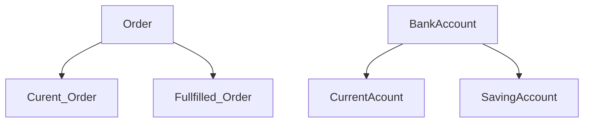
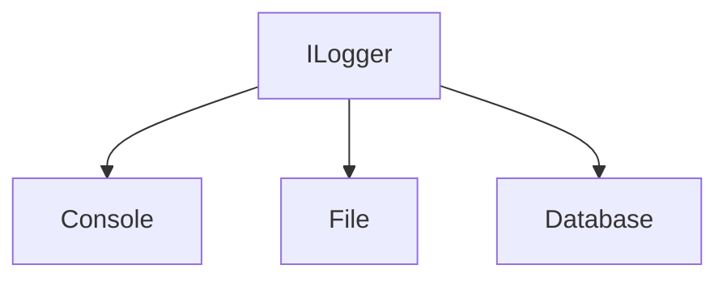

#SOLID
by Uncle Bob

### Single responsibility Principle

One class only have one and only one responsibility

### Open/Close Principle

Open for extension but closed for modification

-  **OPEN**: 1 Class nên mở rộng những tính năng mới. Bằng cách này chỉ cần test tính năng mới
-  **CLOSED**: 1 Class đã được devepoled và tested chỉ nên được thay dổi để sửa lỗi chứ ko sửa tính năng



### Liskov Subtituation Principle

### Interface Segregation Principle

```
   interface OrderService{
      void orderBugger(int quality);
      void orderFries(int quality);
      oid orderCombo(int buggers, int fries);
   }
```

===>

```
   interface BuggerOrderService{
      void orderBugger(int quality);
   }
```

```
   interface FriesOrderService{
       void orderFries(int quality);
   }
```

### Dependency Invertion Principle

High-level Module should not be depend on Low-Level Module. They should depend on abstract class or interface


